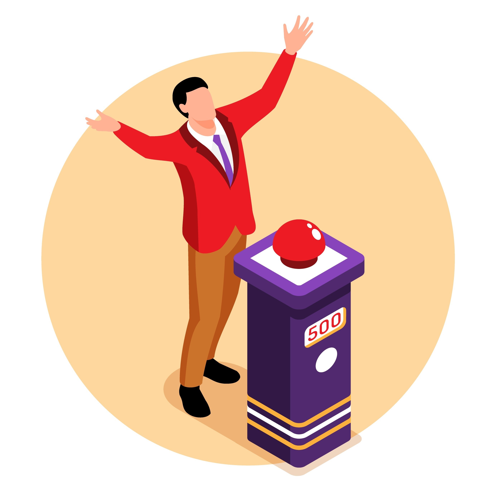

# react-node-buzzer
<div id="top"></div>

<!-- PROJECT SHIELDS -->
<!--
*** I'm using markdown "reference style" links for readability.
*** Reference links are enclosed in brackets [ ] instead of parentheses ( ).
*** See the bottom of this document for the declaration of the reference variables
*** for contributors-url, forks-url, etc. This is an optional, concise syntax you may use.
*** https://www.markdownguide.org/basic-syntax/#reference-style-links
-->

[![LinkedIn][linkedin-shield]][linkedin-url]


<!-- PROJECT LOGO -->
<br />
<div align="center">
  <a href="https://github.com/othneildrew/Best-README-Template">
    
  </a>

  <h3 align="center">Multiplayer Quiz Buzzer</h3>

  <p align="center">
    A multiplayer buzzer 
  </p>
</div>

<!-- TABLE OF CONTENTS -->
<details>
  <summary>Table of Contents</summary>
  <ol>
    <li>
      <a href="#about-the-project">About The Project</a>
      <ul>
        <li><a href="#built-with">Built With</a></li>
      </ul>
    </li>
    <li>
      <a href="#getting-started">Getting Started</a>
      <ul>
        <li><a href="#prerequisites">Prerequisites</a></li>
        <li><a href="#installation">Installation</a></li>
      </ul>
    </li>
    <li><a href="#usage">Usage</a></li>
    <li><a href="#roadmap">Roadmap</a></li>
    <li><a href="#contributing">Contributing</a></li>
    <li><a href="#license">License</a></li>
    <li><a href="#contact">Contact</a></li>
    <li><a href="#acknowledgments">Acknowledgments</a></li>
  </ol>
</details>


<!-- ABOUT THE PROJECT -->
## About The Project

[![Product Name Screen Shot][product-screenshot]](https://example.com)

In 2021 I decided I wanted to host a quiz for my friends. A little tired of playing the same games every time we all got together, I thought it would be fun to switch it up (mostly I think I just wanted the opportunity to channel the cheery disdain of Jeremy Paxman).

While hosting a [University Challenge](https://en.wikipedia.org/wiki/University_Challenge) style quiz for my friends, I bought one little reception bell for each team. I found it was a lot trickier than expected to tell who buzzed in first, leading to a lot of aggrieved competitors!

To provide an impartial (and more accurate!) judge, I made a multiplayer buzzer system using:

* [React.js](https://reactjs.org/)
* [Node JS](https://nodejs.org/en/)
* [Socket.io](https://socket.io/)

This is not a revolutionary idea! But having made some simple React applications before, I thought this would be a great project to teach myself Node JS and WebSockets.

<!-- USAGE EXAMPLES -->
## How It Works

A user should start with a prompt to enter their name. Once submitted, they are routed to a screen providing the option to either host their own game or join an existing one. This is all rendered with React. 

On trying to create or join a game, an attempt is made to connect to the Socket.io server which acts as a source of truth for the state of all users and the games they're in. If successful, you should be sent to the buzzer screen. On buzzing, all users in the same game will be alerted to who buzzed first and the buzzer will be disabled until the game admin (the user who created the game) re-enables it.

When successfully creating or joining a game, a unique session ID will be saved in local storage in the browser. The username and room associated with this session ID on the server side. This means that if, for example, the user's device is locked, they can refresh the page and rejoin the room, ensuring the room state is correct. It's important in particular that the buzz button is in the same state for all users in a given room.

<p align="right">(<a href="#top">back to top</a>)</p>

## Reflections and Lessons Learned

### Persisting Sessions

### Handling page navigation

### Managing communication and state across client and server


<!-- GETTING STARTED -->
## Getting Started

### Prerequisites

The only prerequisite is to have npm installed on your machine.
* npm
  ```sh
  npm install npm@latest -g
  ```

### Installation

To run this locally, clone the repo, install the dependencies and start up the react app and node server respectively:

1. Clone the repo
   ```sh
   git clone https://github.com/btwalpole/react-node-buzzer.git
   ```
3. Install client side dependencies
   ```sh
   cd client
   npm install
   npm start
   ```
3. Install server side dependencies
   ```sh
   cd server
   npm install
   npm start
   ```

<p align="right">(<a href="#top">back to top</a>)</p>


<!-- ROADMAP -->
## Roadmap

- [ ] Provide ability to leave the current room and/or reset your name
- [ ] Improve accessibility
- [ ] Consider using a Context provider for the socket instance

<p align="right">(<a href="#top">back to top</a>)</p>

<!-- CONTACT -->
## Contact

Ben Walpole - btm.walpole@gmail.com

Project Link: [https://github.com/btwalpole/react-node-buzzer](https://github.com/btwalpole/react-node-buzzer)

<p align="right">(<a href="#top">back to top</a>)</p>

<!-- ACKNOWLEDGMENTS -->
## Acknowledgments

Some awesome resources that have helped me on this project:

* [Josh W Comeau - Building a Magical 3D Button](https://www.joshwcomeau.com/animation/3d-button/)
* [Lies Game](https://liesgame.com/)
* [README Template](https://github.com/othneildrew/Best-README-Template)
* [Img Shields](https://shields.io)

<p align="right">(<a href="#top">back to top</a>)</p>

<!-- MARKDOWN LINKS & IMAGES -->
<!-- https://www.markdownguide.org/basic-syntax/#reference-style-links -->
[linkedin-shield]: https://img.shields.io/badge/-LinkedIn-black.svg?style=for-the-badge&logo=linkedin&colorB=555
[linkedin-url]: www.linkedin.com/in/ben-walpole-64a63310a
[product-screenshot]: images/screenshot.png
